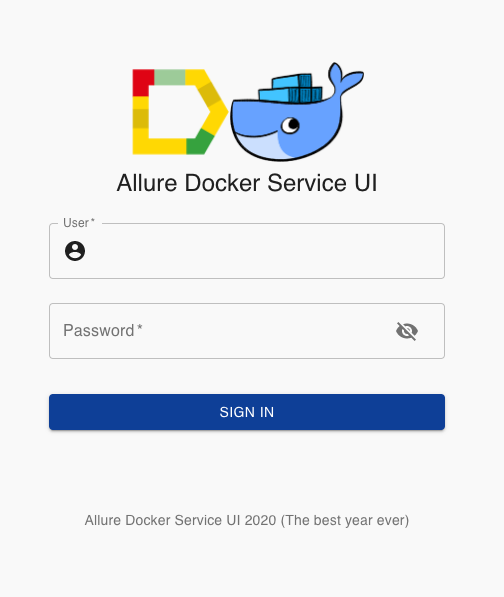
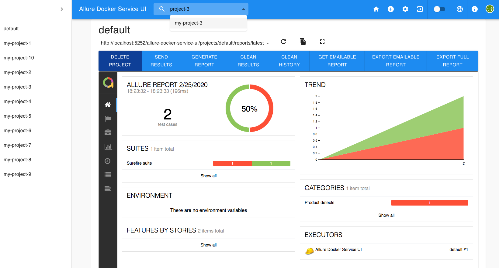

[](http://allure.qatools.ru/)
[](https://docs.docker.com/)
[](https://reactjs.org/)

# ALLURE-DOCKER-SERVICE UI

Table of contents
=================
   * [FEATURES](#FEATURES)
      * [Docker Hub](#docker-hub)
      * [Docker Versions](#docker-versions)
   * [USAGE](#USAGE)
      * [Docker on Unix/Mac](#docker-on-unixmac)
      * [Docker on Windows (Git Bash)](#docker-on-windows-git-bash)
      * [Docker Compose](#docker-compose)
      * [Implementation Examples](#implementation-examples)
      * [Accessing UI](#accessing-ui)
      * [Extra options](#extra-options)
          * [Get Info](#get-info)
          * [Add Custom URL Prefix](#add-custom-url-prefix)
   * [SUPPORT](#SUPPORT)
      * [Gitter](#gitter)
   * [DOCKER GENERATION (Usage for developers)](#docker-generation-usage-for-developers)

## FEATURES
Allure Docker Service UI provides a friendly user interface for [frankescobar/allure-docker-service](https://github.com/fescobar/allure-docker-service) API container.

[](resources/signin-allure-docker-service-ui.png)
[](resources/allure-docker-service-ui.png)

### Docker Hub
- Repository: [frankescobar/allure-docker-service-ui](https://hub.docker.com/r/frankescobar/allure-docker-service-ui/)

### Docker Versions
Docker container versions are publish on [https://github.com/fescobar/allure-docker-service-ui/releases](https://github.com/fescobar/allure-docker-service-ui/releases)

#### Image Variants
Allure Docker Service supports architectures amd64, arm/v7 and arm64.

- Tags: https://hub.docker.com/r/frankescobar/allure-docker-service-ui/tags

## USAGE
### Docker on Unix/Mac
```sh
docker run -p 5050:5050 -e CHECK_RESULTS_EVERY_SECONDS=NONE -e KEEP_HISTORY=1 \
           -v ${PWD}/projects:/app/projects \
           frankescobar/allure-docker-service

docker run -p 5252:5252 -e ALLURE_DOCKER_PUBLIC_API_URL=http://localhost:5050 \
           frankescobar/allure-docker-service-ui
```

### Docker on Windows (Git Bash)
```sh
docker run -p 5050:5050 -e CHECK_RESULTS_EVERY_SECONDS=NONE -e KEEP_HISTORY=1 \
           -v "/$(pwd)/projects:/app/projects" \
           frankescobar/allure-docker-service

docker run -p 5252:5252 -e ALLURE_DOCKER_PUBLIC_API_URL=http://localhost:5050 \
           frankescobar/allure-docker-service-ui
```

### Docker Compose
Using docker-compose is the best way to manage containers: [allure-docker-multi-project-example/docker-compose.yml](https://github.com/fescobar/allure-docker-service-examples/blob/master/allure-docker-multi-project-example/docker-compose.yml)

```sh
version: '3'
services:
  allure:
    image: "frankescobar/allure-docker-service"
    environment:
      CHECK_RESULTS_EVERY_SECONDS: NONE
      KEEP_HISTORY: 1
      KEEP_HISTORY_LATEST: 25
    ports:
      - "5050:5050"
    volumes:
      - ${PWD}/projects:/app/projects

  allure-ui:
    image: "frankescobar/allure-docker-service-ui"
    environment:
      ALLURE_DOCKER_PUBLIC_API_URL: "http://localhost:5050"
      ALLURE_DOCKER_PUBLIC_API_URL_PREFIX: ""
    ports:
      - "5252:5252"
```

```sh
docker-compose up allure allure-ui
```

If you want to run in background:

```sh
docker-compose up -d allure allure-ui
```

You can see the logs:

```sh
docker-compose logs -f allure
docker-compose logs -f allure-ui
```

### Implementation Examples
Check examples here:
[frankescobar/allure-docker-service-examples](https://github.com/fescobar/allure-docker-service-examples)

### Accessing UI
Open your browser and access to the UI: http://localhost:5252/allure-docker-service-ui

### Extra options
#### Get Info
You can get extra info using the next urls:

- http://localhost:5252/allure-docker-service-ui/config

- http://localhost:5252/allure-docker-service-ui/version

#### Add Custom URL Prefix
Configure an url prefix if your deployment requires it (e.g. reverse proxy with nginx)
```sh
    environment:
      URL_PREFIX: "/my-prefix"
```
With this configuration you can request the UI in this way too:
```sh
curl http://localhost:5252/my-prefix/allure-docker-service-ui
```


## SUPPORT
### Gitter
[](https://gitter.im/allure-docker-service/community?utm_source=badge&utm_medium=badge&utm_campaign=pr-badge)


## DOCKER GENERATION (Usage for developers)
### Install Docker
```sh
sudo apt-get update
```
```sh
sudo apt install -y docker.io
```
If you want to use docker without sudo, read following links:
- https://docs.docker.com/engine/installation/linux/linux-postinstall/#manage-docker-as-a-non-root-user
- https://stackoverflow.com/questions/21871479/docker-cant-connect-to-docker-daemon

### Build image
```sh
docker build -t allure-ui-release -f docker/Dockerfile --build-arg VERSION=na --build-arg VCS_REF=na --build-arg BUILD_DATE=na .
```
### Run container
```sh
docker run -d  -p 5252:5252 allure-ui-release
```
### See active containers
```sh
docker container ls
```
### Access to container
```sh
docker exec -it ${CONTAINER_ID} bash
```
### Access to logs
```sh
docker exec -it ${CONTAINER_ID} tail -f log
```
### Remove all containers
```sh
docker container rm $(docker container ls -a -q) -f
```
### Remove all images
```sh
docker image rm $(docker image ls -a -q)
```
### Remove all stopped containers
```sh
docker ps -q -f status=exited | xargs docker rm
```
### Remove all dangling images
```sh
docker images -f dangling=true | xargs docker rmi
```
### Register tagged image (Example)
```sh
docker login
docker tag allure-ui-release frankescobar/allure-docker-service-ui:${PUBLIC_TAG}
docker push frankescobar/allure-docker-service-ui
```
### Register latest image (Example)
```sh
docker tag allure-ui-release frankescobar/allure-docker-service-ui:latest
docker push frankescobar/allure-docker-service-ui
```
### Download latest image registered (Example)
```sh
docker run -d  -p 5252:5252 frankescobar/allure-docker-service-ui
```
### Download specific tagged image registered (Example)
```sh
docker run -d -p 5252:5252 frankescobar/allure-docker-service-ui:7.0.0
```
